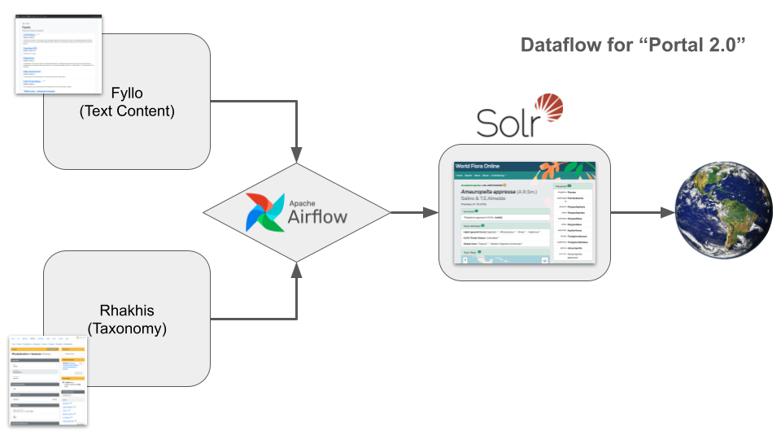

This is the documentation for systems admins and developers of the World Flora Online.

## Very high level overview

At a very high level there are four systems: two editing platforms (one for the classification and one for the text based content) that feed into a portal for publication as a portal/website. This process is orchestrated by DAGs in an instance Apache Airflow.

The editing platforms (Rhakhis for the classification and Fyllo for the text) are LAMP (Linux, Apache, MySQL, PHP) stack applications. The portal is a PHP application running against an instance of the Apache SOLR Index.

### Rhakhis - classification editor

### Fyllo - content management

