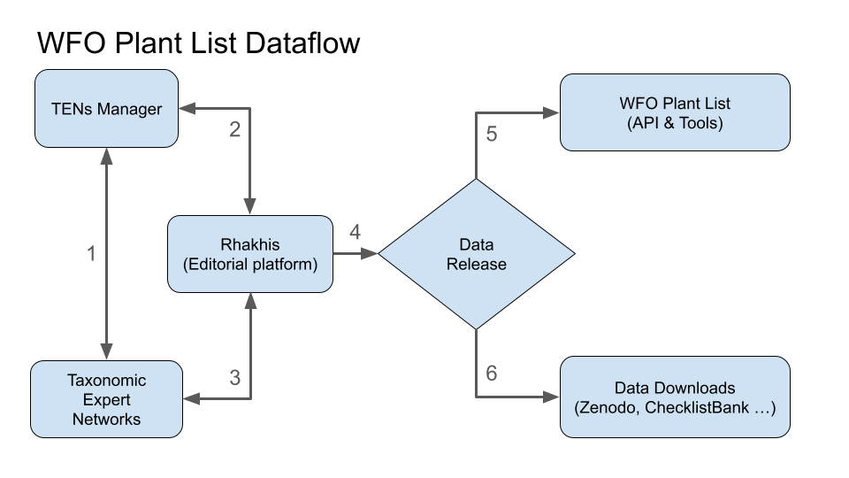
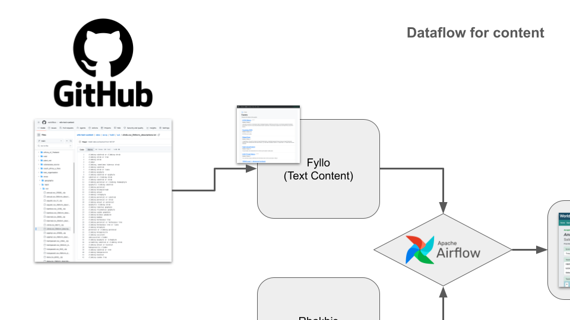
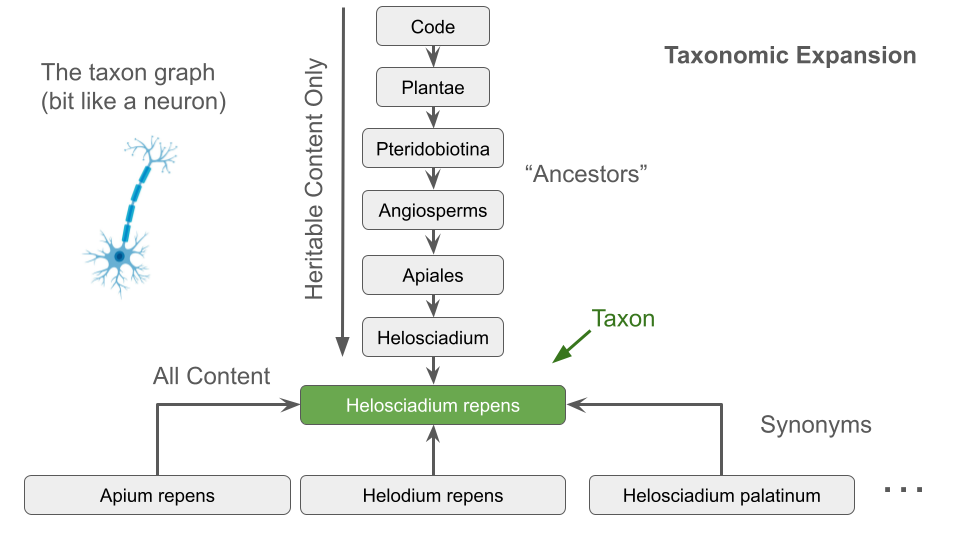

This is the documentation for systems admins and developers of the World Flora Online.

{{toc}}

## Very high level overview

There are four systems:
  - Two editing platforms (one for the classification and one for the text based content)
  - A public portal for publication
  - An instance Apache Airflow that orchestrates the publication and backup processes.

The editing platforms (Rhakhis for the classification and Fyllo for the text) are LAMP (Linux, Apache, MySQL, PHP) stack applications. The portal is a PHP application running against an instance of the Apache SOLR Index.

### Rhakhis - classification editor

The classification (nomenclature and taxonomy) has its own worflow process that generates a versioned instance of the data (known as the WFO Plant List) every six months, on each solstice. 

### Fyllo - content management

The content management platform handles faceting data and text descriptions bound to the name IDs used in the classification produced by Rhakhis.

The data is curated in CSV files stored in GitHub. Fyllo stores the metadata about those files, imports them and performs the process of taxonomic expansion as the data is pushed to the public portal.

### Taxonomic expansion

The classification consists of a nested hierarchy of taxa. Each taxon has an accepted name and zero to many synonymous names. Data managed by Fyllo is tagged with name IDs __not__ taxon IDs because the taxa in the classification may vary between different versions of the published classification. The content in the portal is displayed on the basis taxa in the current classification. Taxonomic expansion is the process whereby name tagged data is bound to appropriate taxa according to the current classification. 

