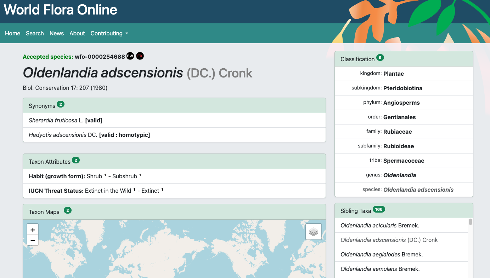
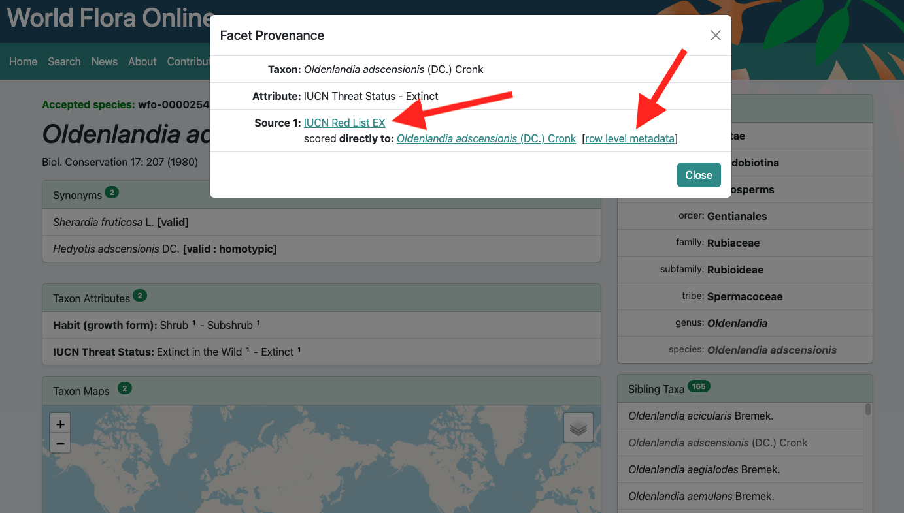
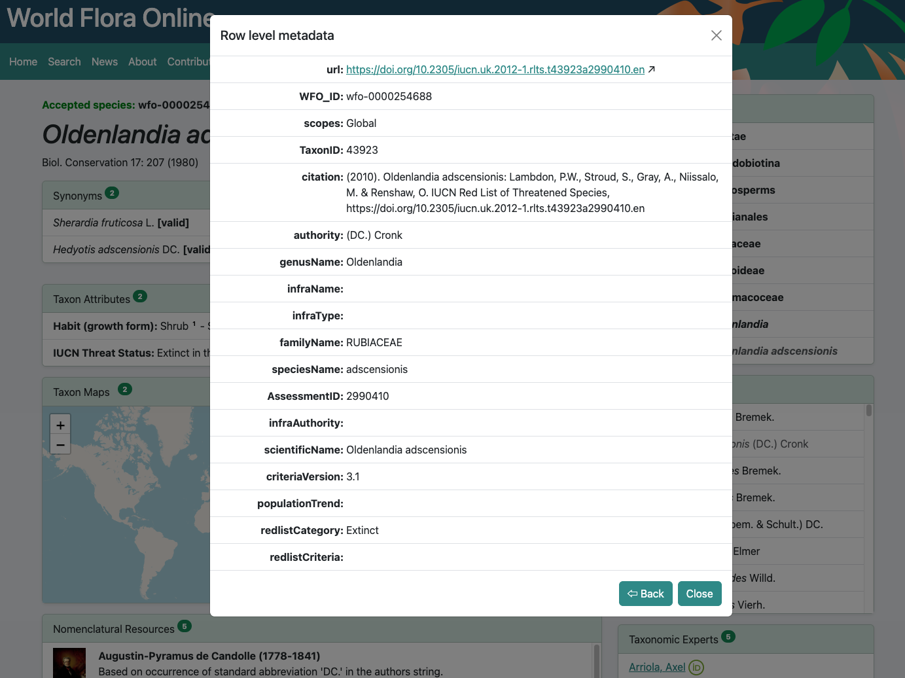

The data that is displayed in the public website and via the API is all stored in a [Apache SOLR](https://solr.apache.org/) index. Understanding how it all gets there and how it is structured is key to understanding how the website and API function as well as the systems that feed data into the index. Because multiple systems are involved it can be confusing jumping around the documentation. This page is here to give an over view and hopefully act as a single source of truth.


  1. Taxonomy and nomenclature is curated in Rhakhis to produce a coherent classification of plant names. This is pushed to SOLR index every six months as the solstice data releases. This is done manually as a single import file. It takes less than an hour to run. It produces an index with only taxonomic data in it, no content describing the taxa.
  1. Text based content is deposited as CSV files (spreadsheets) in [a GitHub repository](https://github.com/worldflora/wfo-text-content) and then curated in Fyllo. Every row in every CSV file starts with a WFO name ID. The data is therefore bound to names not to accepted taxa. Fyllo has the following functions:
     1. It specifies a collection of facets (e.g.Habit) and facet values (e.g.Tree) as well as text snippet categories (e.g. Description) and languages.
     2. It specifies which data files in the GitHub repository will be published to the portal and which facets values or snippet categories they are associated with.
     3. It associates metadata about the data sources with the CSV files so that full credit for contributions can be given.
     4. When provided with the graph of names for a taxon it carries out the process of __taxonomic expansion__ and returns the facet values and snippets for the taxon. Other than during this process it doesn't know which names are accepted and which are synonyms.
  1. A process in AirFlow updates the index with content from Fyllo so that it contains descriptive content for use in the portal. This process currently takes around 15hrs to index all the taxa. It can be run continuously (refreshing the complete index every 24hrs) or only when major updates have been made to the data. 

## The SOLR schema

A SOLR index is a collection of documents. Each document is a flat list of fields containing the data. Fields have a specific data type and can be single or multi-valued. Unlike in an SQL database tables the documents don't all have to have the same fields. 

Document fields can be specified in broadly two ways, either as part of a ridged configuration or with dynamic field mappings. If dynamic fields are used the data type is indicated by the ending of the field name. WFO uses dynamic fields almost exclusively along with the standard ending-to-type mappings that come with SOLR. This makes it very simple to set up a new instance of the index and populate it or to change fields on a live system. A new core is created and (typically using the web admin interface) a single copy from * and to `_text_` is defined. This means all text added in any field will be available in the `_text_` field if necessary. From that point on the applications contributing data to the index can just provide whatever fields they like. It is all very flexible but there needs to be conventions on field naming to prevent chaos. In production the SOLR index is protected behind firewalls, passwords and API keys to prevent just anyone submitting data and adding fields to it!

## Kinds of documents stored

  1. __Name Documents__ represent the classification as published every six months from Rhakhis. They all have a `classification_id_s` field that specifies which data release they are part of (e.g. `2026-06`). They also have a `role_s` field that specifies what role they play in the classification (`accepted, synonym, unplaced or deprecated`). The basic data comes from the solstice data releases and forms a complete, free standing taxonomic checklist as used in the the WFO Plant List. For the portal these documents are __augmented__ or __decorated__ with extra fields managed by Fyllo. (See more below).
  2. __Metadata Documents__ contain information for use in the portal that is shared between multiple name documents. These are what facilitate full provenance information to be piped from a CSV file in GitHub, through Fyllo, to a taxon page in the public portal. There are currently two kinds of metadata documents
      1. __Data Source__ documents contain details about the data source. This is basically the contents of the data source page in Fyllo piped into the index. The documents have a field called `kind_s` with a value of `wfo-snippet-source` or `wfo-facet-source`. The SOLR IDs of these documents are or the form `ds-<fyllo data source pk>`.
      2. __Facet__  documents containing information about the facets and their possible values as stored in Fyllo. The documents have a field called *kind_s* with a value of *wfo-facet*. The SOLR IDs of these documents are or the form `wfo-f-<fyllo facet pk>`.
    
## Provenance walk through (user's viewpoint)

A summary of the whole, somewhat complex, data flow is that we: "Take CSV files in GitHub and display them nicely in the public website". Here we will show how this is the case with an example. This is test data and may change but the principles will remain the same.



The image above is a screenshot of the taxon page for *Oldenlandia adscensionis*. According to the IUCN this is an extinct plant. `Extinct` is a value of the facet `IUCN Threat Status` The red arrows point to the two places in the interface where this is displayed. (Facets and their values can be displayed in multiple places. Even the maps are currently just a rendering of the country and TDWG area occurence facets.)

The little superscript `1` next to Extinct on the page (lower arrow) indicates that there is a single data source for this assertion. If you click on the `1` a modal dialogue box is displayed showing the datasources for the facet value in this taxon.



This dialogue only lists one data source but for other facet values there may be many. For example, there may be multiple sources saying that they consider a species to be a tree. The two links indicated by the arrows will lauch different modal dialogues but before we click them it is worth considdering the text in bold "__directly to__". Through the process of taxonomic expansion it is possible for a taxon to be scored to an attribute value via one of its synonyms, in which case this would say "__via the synonym__", or via an ancestor. In these cases the linked name would be different. This means we know which name the original observation/assertion was tagged with and that we are assuming it applies to but we are assuming that it applies to the accepted taxon here. The user is free disagree!

If we click on the right hand arrowed link `[row level metadata]` we get the dialogue box below.



## How to:

### Import the latest Rhakhis data release

On the machine running the SOLR index, download the latest Plant List json file and unzip it. Run the following command to post it to the index. Make sure the name of the core is correct, in this case "wfo-portal" and insert the correct password. This process will take about half an hour to an hour depending on the load on the machine.

```
curl -H 'Content-type:application/json' 'http://localhost:8983/solr/wfo-portal/update?commit=true' -X POST -T plant_list_2026-06.json --user wfo:****
```

### Delete documents from the index

This is done through the SOLR web admin interface

  1. Select the correct index usually "wfo-portal"
  2. Select the Documents tool so we are using the /update handler as opposed to the query handler
  3. Pick the "SOLR Command raw or XML format.
  4. Put the delete command in to the Documents box e.g. ```{"delete":{"query":"*:*"} }```
  5. Change the commit to 1
  6. Submit the form

The example above will delete everything because the query *:* matches all documents. It is appropriate for a clean start. 

### Create or delete a complete index core

On the commandline on the machine running SOLR, set the authentication variable (adding in the password):
```
SOLR_AUTH_TYPE="basic"
SOLR_AUTHENTICATION_OPTS="-Dbasicauth=wfo:****"
```

Then run the command to create or delete

```
sudo su - solr -c "/opt/solr/bin/solr create -c wfo-portal"
```

