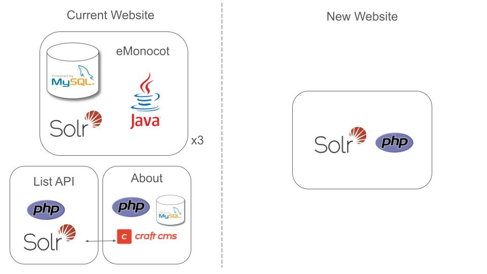
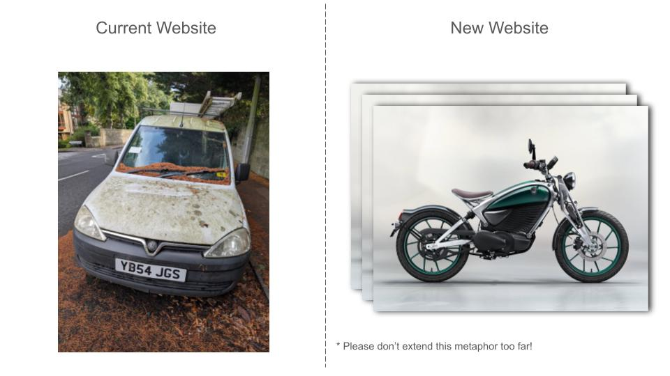

15 minutes isn't long enough to give a full demo of the website or cover how the data pipeline works.

## Technical debt

- Introduce the two different tech stacks (applications used).
- These are just for serving the data to the public. Not the editorial platforms.
- We are resource constrained and the left stack is holding us back.
- x3 is the loading and testing environments at MOBOT

- Metaphor is an old car that the mechanic is begging you not to bring back to his garage again.
- vs a nice new electric motorbike. 
- Very different beasts
- And we can have multiple bikes if we like!

## Test site overview

- <https://wfo-test.rbge.info/>
- Bot protection system is built in - demo
- Very similar to what was presented in 18 months ago in Bahamas 
- Go head was given 6 months ago in Edinburgh
- Dismantled and reassembled since then. 
- Demonstration to production code with attention on data pipelining
- Still some features that have not be re-implemented

## Basic search and data provenance 

- Grandidiera boivinii
- IUCN Least concern
  - show icon
  - show in attribute list
  - show provenance
  - show row level metadata
- Map
  - Turn TDWG layer off
  - Click country Mozambique 
  - Show two sources
  - Show parsed GBIF data
  - Show row level and click through to specimen
- Text snippet
  - Show tropical east africa prov
  - Click through to github
  - Show other data in github

## Faceted search and download

- <https://wfo-test.rbge.info/search>
- Select Mozambique and Trees
- Download html 

## Complex example

- <https://wfo-test.rbge.info/wfo-0000896829>
- Different IUCN threat statuses because of taxonomy
- Different ways of scoring the text snippets
- Many of the issues we face are data driven not presentational

## Supporting text

- Only the search link is run by the core repository
- Subsequent links can easily be define
- THIS IS NO LONGER RUN BY A CMS
- We need someone who coordinates this

## Managing deployment

- Three streams
- Deploying to MOBOT <https://plant-list-docs.rbge.info/manual/deploying.html> - Roger 
- Content - CITES, GBIF data, snippets in wrong order etc -  Amber & Alan
- Supporting text & other features - Features group and comms team.
- __Prioritization__ is key and this will be managed professionally <https://github.com/worldflora/wfo-p2/milestones> and assignment of tasks.

